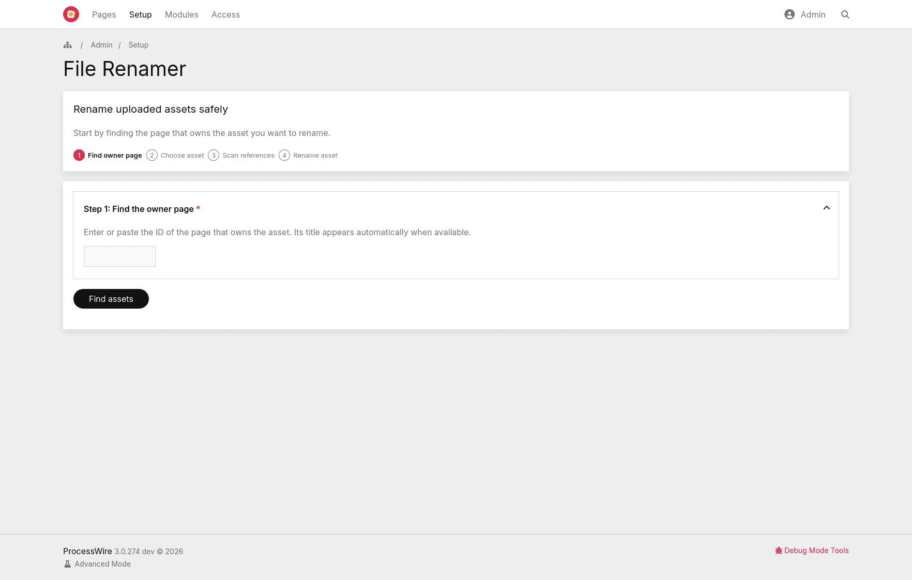
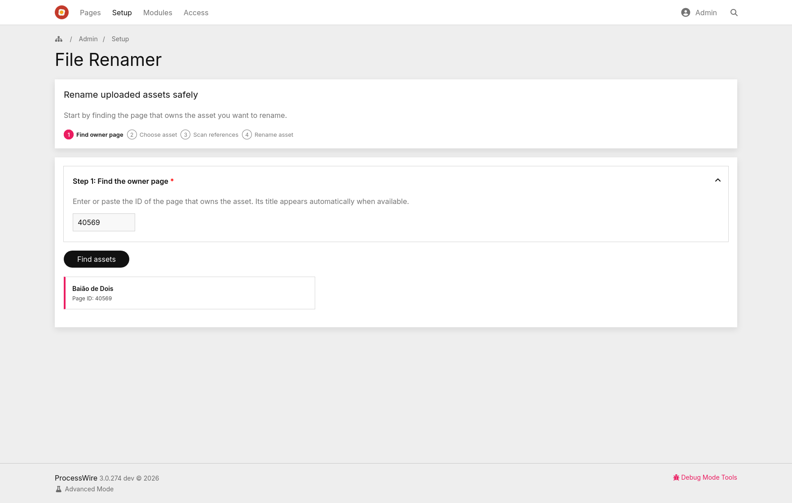
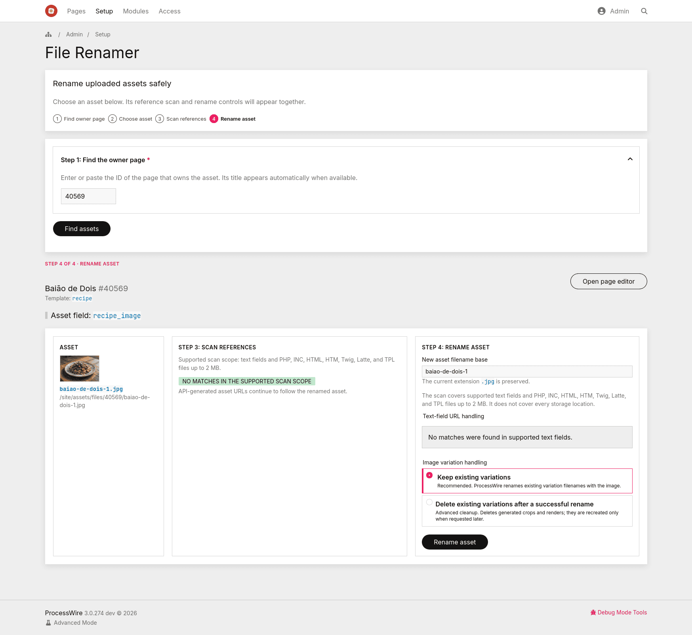
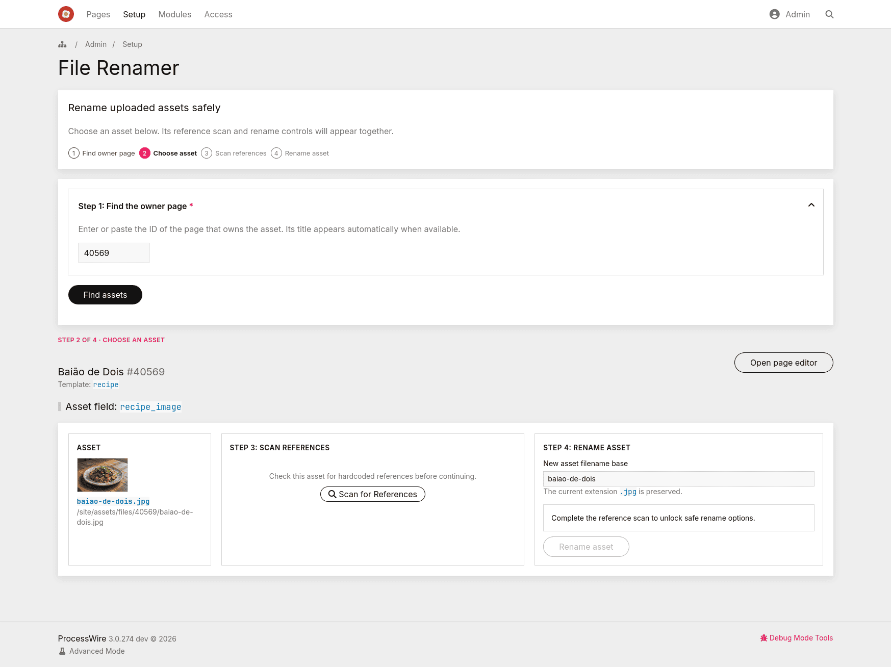

# ProcessFileRenamer

A small admin utility for safely renaming the basenames of uploaded assets. An asset is a ProcessWire `Pagefile` or `Pageimage`.

Current module version: **1.3.0**.

It is designed for one-asset-at-a-time maintenance, not bulk renaming.

## What it does

- Adds **Setup > File Renamer** in the ProcessWire admin.
- Renames one asset at a time through ProcessWire’s file APIs, retaining its extension and preventing filename collisions.
- Requires the `file-renamer` permission plus page and field access.
- Scans supported text fields and template files for hardcoded asset URLs before renaming.
- Can update writable text-field URLs and warns about template-file references for manual review.
- Keeps the scan on demand and blocks the rename when its safety coverage is incomplete.
- Logs completed and partial operations to **Setup > Logs > file-renamer**.

## Screenshots

### 1. Find the owner page



### 2. Confirm the page ID



### 3. Choose an asset


### 4. Review the reference scan and rename options



### 5. View the renamed asset



## Why this approach

ProcessWire asset fields should be renamed through the Pagefile/Pageimage API. `Pagefile::rename()` expects only an asset basename, no path, and ProcessWire's own API reference says to follow the rename with `$page->save()` for the owning page.

This module uses the ProcessWire API instead of manually moving files in `/site/assets/files/`.

The scan uses a small framework-free JavaScript file. It is intentionally bounded: large or unreadable templates, text-field result overflows, and references that the current role cannot update stop the rename rather than presenting an incomplete “safe” result.

## Installation

1. Copy the `ProcessFileRenamer` folder to:

   ```text
   /site/modules/ProcessFileRenamer/

```

2. In ProcessWire admin, go to **Modules > Refresh**.
3. Install **File Renamer**. The module requires ProcessWire 3.0.262+ and PHP 7.4+.
4. Give trusted roles the `file-renamer` permission.
5. Open **Setup > File Renamer**.

## Usage

1. Find the page that owns the uploaded asset by entering its ID. Its title appears automatically, and the form warns before submission when no assets are available to rename.
2. Choose the asset from the listed uploaded asset fields.
3. Select **Scan for References**. The rename button becomes available only after a complete scan.
4. Enter a new asset filename base. The existing extension is retained; ProcessWire applies its normal filename normalization.
5. Review the scan scope, references, and any blocking condition.
6. Choose **Text-field URL handling**:
* **Update matched text URLs after rename**, recommended when references are found.
* **Do not update text fields**, manual mode. The rename is blocked while hardcoded text URLs are present.


7. For images, choose **Image variation handling**:
* **Keep existing variations**, recommended default.
* **Delete existing variations after a successful rename**, advanced cleanup. Deleted variations are not recreated during the rename. They are generated later only when your template/API requests the same size again.


8. Click **Rename asset**. The server repeats the scan and permission checks before changing anything.

Example:

```text
old filename: my_bad_name.jpg
new filename base: better-image-name
result: better-image-name.jpg

```

## Safety behavior

The module blocks the rename when writable text-field references are found unless **Update matched text URLs after rename** is selected.

The module blocks the rename when template-file references are found unless **I reviewed the template-file warnings** is selected. It does not edit PHP/template files automatically.

The submit workflow repeats the permission, scan-completeness, collision, and reference checks on the server. Client-side controls are a usability aid, not a security boundary.

API-rendered usages such as `$image->url`, `$file->url`, `$page->images`, and `$page->files` should continue to work because the file object is renamed and the owning page field is saved.

The scan covers supported text fields and PHP, INC, HTML, HTM, Twig, Latte, and TPL files up to 2 MB. It does not cover every storage location, for example:

* CSS files
* JavaScript files
* custom JSON blobs
* database tables not represented by ProcessWire text/textarea fields
* external caches/CDNs
* third-party module storage

## Image variations

For images, the recommended default is **Keep existing variations**. ProcessWire renames existing resized/cropped filenames with the image, and hardcoded variation URLs in writable text fields can be updated.

The **Delete existing variations after a successful rename** option is advanced. It calls `Pageimage::removeVariations()` only after the owner field and text-reference updates succeed. Those deleted files are not recreated during the rename itself. ProcessWire creates/caches a variation later when your template/API requests the same size again, for example with `$image->size(...)`.

The module blocks variation deletion if it finds hardcoded variation URLs, because deleting those files could break existing rich text references or cached frontend markup.

## Install and uninstall behavior

The module defines explicit `___install()` and `___uninstall()` methods.

On install, it calls `parent::___install()` so ProcessWire can create the admin Process page from the module `page` metadata. It then creates the `file-renamer` permission only when needed and records whether the module created it.

On uninstall, it calls `parent::___uninstall()` so ProcessWire can remove the admin Process page. It deletes the `file-renamer` permission only if the module recorded that the permission did not exist before installation. This avoids deleting a same-named permission that may have been created manually or by another module.

The module intentionally does **not** declare `file-renamer` in the module metadata's `permissions` property, because ProcessWire treats that metadata as permissions installed by the module. Permission ownership is handled explicitly instead.

## Permissions

The module requires:

```text
file-renamer

```

The permission is created by `___install()` when missing. It is not listed in the module `permissions` metadata so uninstall cleanup can remain ownership-aware.

Only give this permission to trusted admin users. The module checks page visibility and field editability on initial render, AJAX scan, final execution, and each cross-page text update. A hidden or non-editable matching reference blocks the rename without exposing its page or field details.

## Audit log

Each successful rename writes one line to the ProcessWire log named:

```text
file-renamer

```

The log includes:

* user name
* page ID
* field name
* old basename
* new basename
* number of text references updated
* number of image variations removed
* completion or partial-failure status

## Limitations

This version focuses strictly on isolated asset maintenance and structural reliability.

It does not support bulk renaming assets across multiple pages.
It does not edit template files.
It does not scan every possible storage location.
It does not support multilingual text replacement beyond string values returned directly by the field.
It does not scan Pagefile custom filedata fields, image descriptions, CSS files, JavaScript files, cache files, or external systems.

See [CHANGELOG.md](CHANGELOG.md) for the complete release history.
